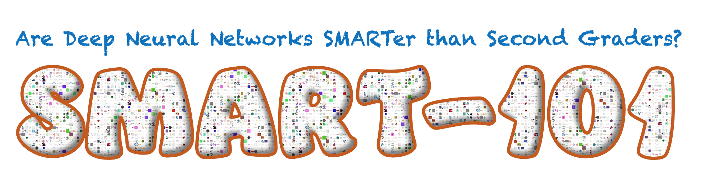

<!--
Copyright (C) 2023 Mitsubishi Electric Research Laboratories (MERL)

SPDX-License-Identifier: MIT
-->

<!--
Copyright (C) 2023 Mitsubishi Electric Research Laboratories (MERL)

SPDX-License-Identifier: MIT
-->



## Overview

Recent times have witnessed an increasing number of applications of deep neural networks towards solving tasks that require superior cognitive abilities, e.g., playing Go, generating art, ChatGPT, etc. Such a dramatic progress raises the question: how generalizable are neural networks in solving problems that demand broad skills? To answer this question, we propose SMART: a Simple Multimodal Algorithmic Reasoning Task (and the associated SMART-101 dataset) for evaluating the abstraction, deduction, and generalization abilities of neural networks in solving visuo-linguistic puzzles designed specifically for children of younger age (6--8). Our dataset consists of 101 unique puzzles; each puzzle comprises a picture and a question, and their solution needs a mix of several elementary skills, including pattern recognition, algebra, and spatial reasoning, among others. To train deep neural networks, we programmatically augment each puzzle to 2,000 new instances; each instance varied in appearance, associated natural language question, and its solution. To foster research and make progress in the quest for artificial general intelligence, we are publicly releasing our PyTorch implementation.

This repository contains training and testing code reported in the CVPR 2023 paper <a href=https://arxiv.org/pdf/2212.09993.pdf>Are Deep Neural Networks SMARTer than Second Graders?</a> ***by Anoop Cherian, Kuan-Chuan Peng, Suhas Lohit, Kevin A. Smith, and Joshua B. Tenenbaum***.

## Code Setup
```
    conda create --name SMART python=3.9
    conda activate SMART
    pip install -r requirements.txt
    pip install git+https://github.com/openai/CLIP.git
```

## SMART-101 Data Setup
```
    # Download the SMART-101 dataset from https://zenodo.org/record/7775984
    # To download you can use: wget https://zenodo.org/record/7775984/files/SMART101-release-v1.zip?download=1 -P <SAVE_FOLDER>
    # cd <SAVE_FOLDER>
    # unzip SMART101-release-v1.zip -d <ROOT> >/dev/null
```

After the unzip, `<ROOT>` will have the directory structure: `<ROOT>/SMART101-release-v1/SMART101-Data` -- this is the location where the 101 puzzles are stored.

***Known Issue:*** You will receive an error on `<ROOT>/SMART101-release-v1/SMART101-Data/62/puzzle_63.csv` when running the code. To resolve this problem, you will need to rename `<ROOT>/SMART101-release-v1/SMART101-Data/62/puzzle_63.csv` to `<ROOT>/SMART101-release-v1/SMART101-Data/62/puzzle_62.csv`.

## Train and Test Command Lines
Our implementation provides a variety of options to train and test diverse state-of-the-art neural network models. Please see `main.py` for all options. Below, we list a few command lines to get started and the arguments that you may change for learning using other backbones. All the backbones are downloaded or implementd in `net.py` or `net_clip.py` (where the latter is only used for `CLIP` feature extraction).

### Command lines
***To train a ResNet-50 + BERT backbone*** while also fine-tuning the ResNet-50 model for 100 epochs with a classifier head and puzzle specific output heads (the best option used in our paper), use the command line:

```
python main.py --model_name resnet50 --num_workers 8 --num_epochs 100 --loss_type classifier --batch_size 64 --log_freq 10 --train_backbone --word_embed bert --data_root <ROOT>/SMART101-release-v1/SMART101-Data/ --puzzles all --split_type standard
```
Here, `--train_backbone` is for training the image backbone model, `--puzzles all` says to train on all puzzles, and `--split_type standard` specifies `instance split` to use. The above command will produce the results in a folder `<args.save_root>/results/<seed>` where `<seed>` is a random seed number for a "run" of the above code (e.g., you may specify `--seed 1234` in the commandline above and the default `<args.save_root>` is `./data/v2/`). The best validation model associated with this run will be saved in: `<args.save_root>/checkpoints/ckpt_<model_name>_<seed>.pth`.

***To evaluate a checkpoint*** (without training/finetuning) for a seed (that either you specified in the training code above or is randomly created when the seed is not given), use the command:

```
python main.py --model_name resnet50 --num_workers 8 --num_epochs 100  --loss_type classifier --batch_size 64 --log_freq 10 --train_backbone --word_embed bert --data_root <ROOT>/SMART101-release-v1/SMART101-Data/ --puzzles all --test --seed 1234
```

When the training and evaluation are done, the code reports the Solution accuracy $S_{acc}$, Option accuracy $O_{acc}$, and error variance $err$, where $err$ is the average weighted relative prediction error, which is the average $\ell_1$ distance between the predicted and the ground truth answers, each puzzle error inversely weighted by the cardinality of its answer range. We also report the category-wise accuracy among the eight skill sets as well as, the average accuracy over all instances of a root puzzle used in the evaluation.

### Possible Arguments:
* --split_type: {'standard', 'exclude', 'fewshot', 'puzzle'} corresponding to instance split (IS), answer split (AS), few-shot split (FS), and puzzle split (PS), respectively.
* --model_name: {'resnet50', 'resnet18', 'mae', 'clip', 'flava', 'vit', 'swin_b', 'swin_t', 'alexnet', 'vgg', 'cross_transformer'}
* --word_embed: {'standard', 'bert', 'gpt', 'glove'}, where `standard` uses learned embeddings.
* --loss_type: {'classifier', 'regression'}

You may also use a contrastive learning image backbone (e.g., SimSiam). For this, use the option `--model_name resnet50 --pretrained ./<path_to_pretrained_model>` for a `resnet50` based pretrained model.

### Other Useful Commandlines and tips:
* --baselines: will print the baseline (greedy and uniform) accuracies on all puzzles in train, val, and test.
* --split_type fewshot --fsK <num>: will specify the number of fewshow samples to use
* --data_tot <num>: speficies the total number of puzzle instances to use for each root puzzle (you may ask the method to use less than 2000 instances)
* --puzzles id1,id2,...: You can specify a comma separated list of puzzles to use to do the train and test on only those puzzles (default is --puzzles 'all').
* See globalvars.py to see more hyperparamters (not reachable via commandlines), including the set of puzzles used in "puzzle/fewshot split".

### Outputs:
The code generates outputs in the folder `<args.save_root>`. There are many intermediate data files and performance statistics produced, namely:
* `<args.save_root>/vocab_puzzle_all.pkl`: the word vocabulary used in the learned embeddings
* `<args.save_root>/results/<seed>/acc_perf_scores.png`: puzzle-wise $S_{acc}$ performances
* `<args.save_root>/results/<seed>/opt_acc_perf_scores.png`: puzzle-wise $O_{acc}$ performances
* `<args.save_root>/results/<seed>/cmd_line.txt`: command line used in the current run

Please refer to main.py to see other arguments to the code.

### Trained models:
The best validation model associated with a run is saved at `<args.save_root>/checkpoints/ckpt_<model_name>_<seed>.pth`.

## Citation

If you use this code, please cite the following paper:

```BibTeX
@article{cherian2022deep,
  title={Are Deep Neural Networks SMARTer than Second Graders?},
  author={Cherian, Anoop and Peng, Kuan-Chuan and Lohit, Suhas and Smith, Kevin and Tenenbaum, Joshua B},
  journal={arXiv preprint arXiv:2212.09993},
  year={2022}
}
```

## Contact

Anoop Cherian: cherian@merl.com, Kuan-Chuan Peng: kpeng@merl.com, or Suhas Lohit: slohit@merl.com.

## Contributing

See [CONTRIBUTING.md](CONTRIBUTING.md) for our policy on contributions.

## License

Released under `MIT` license, as found in the [LICENSE.md](LICENSE.md) file. See [DEPENDENCIES.md](DEPENDENCIES.md) for details on publicly available pre-trained models that our software uses, their licenses, and the download links.

All files:

```
Copyright (C) 2023 Mitsubishi Electric Research Laboratories (MERL).

SPDX-License-Identifier: MIT
```
